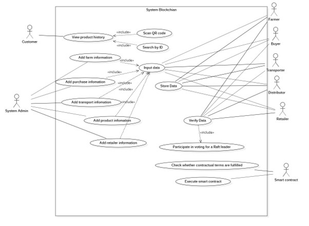

# Tổng quan
- Tên đề tài : Ứng dụng Blockchain trong truy xuất nguồn gốc chuỗi cung ứng (Rau củ quả)
- Hoạch định nguồn lực doanh nghiệp - IS336.M11.HTCL
- Giảng viên hướng dẫn: Ths. Đỗ Duy Thanh
- Nhóm sinh viên thực hiện :
    + Huỳnh Văn Pháp - MSSV: 19521987 (Nhóm trưởng, Code triển khai ứng dụng)
    + Nguyễn Thùy Linh - MSSV: 19521758 (Code triển khai ứng dụng)
    + Hoàng Công Toán - MSSV: 19522359 (Slide, Báo cáo)
    + Võ Xuân Thịnh - MSSV: 19522290 (Slide, Báo cáo)
# Thiết kế hệ thống
### Usecase diagram

### Sequence diagram farmer

