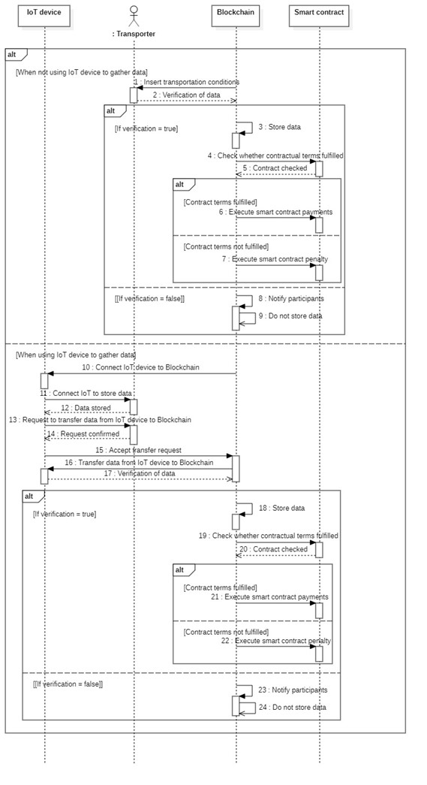
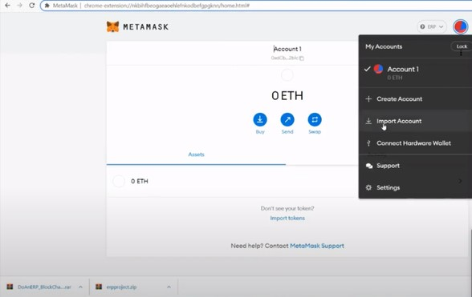
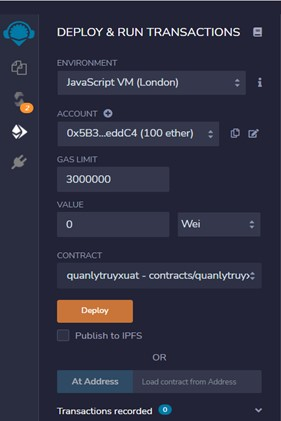

# Tổng quan
- Tên đề tài : Ứng dụng Blockchain trong truy xuất nguồn gốc chuỗi cung ứng (Rau củ quả)
- Hoạch định nguồn lực doanh nghiệp - IS336.M11.HTCL
- Giảng viên hướng dẫn: Ths. Đỗ Duy Thanh
- Nhóm sinh viên thực hiện :
    + Huỳnh Văn Pháp - MSSV: 19521987 (Nhóm trưởng, Code triển khai ứng dụng)
    + Nguyễn Thùy Linh - MSSV: 19521758 (Code triển khai ứng dụng)
    + Hoàng Công Toán - MSSV: 19522359 (Slide, Báo cáo)
    + Võ Xuân Thịnh - MSSV: 19522290 (Slide, Báo cáo)
# Thiết kế hệ thống
### Usecase diagram

### Sequence diagram farmer

### Sequence diagram buyer

### Sequence diagram transporter

### Sequence diagram packager

### Sequence diagram distributor

### Sequence diagram retailer

### Sequence diagram for raft consensus

### Sequence diagram consumer access 

### Class diagram

# Cơ sở dữ liệu

# Triển khai smart contract trên Remix Ethereum
## Import account Ganache vào ví Metamask
### Mở Ganache, chọn Quickstart, sau đó copy RPC Server

### Mở ví Metamask, vào phần Setting -> Networks

### Tiến hành điền RPC Server của Ganache,chain ID và tên Network(Tùy ý) sau đó lưu lại. Vậy là chúng ta đã kết nối được Ganache với Metamask

### Tiến hành Import account Ganache vào Metamask chọn Import accout

### Vào Ganache, lấy ngẫu nhiên 1 trong 10 accout đã được Ganache cho sẵn, sau đó lấy Private Key

### Dán vào phần Past your private key string here:

### Như vậy, ví của chúng ta đã có 100ETH dùng nội bộ

## Deploy trên môi trường ảo Testnet: Remix
### Vào trang https://remix.ethereum.org/

### Tạo smart contract của dự án chúng ta trên remix

### Nhấn vào biểu tượng như hình, sau đó chọn compile để kiểm tra lỗi của contract

### Compile thành công, nhấp vào biểu tượng như hình để Deploy và chạy Transactions

### Ở phần Environment, chọn Injected web3 để kết nối với ví Metamask

### Sau khi kết nối thành công, tiếp tục chọn Deploy để Confirm giao dịch

### Copy địa chỉ hợp đồng và account

### Vào project trên Visual studio code, đến file app.js sau đó xóa và past để thay đổi địa chỉ hợp đồng rồi lưu lại

### Vào file user.json để thay đổi lại Account mới rồi lưu lại

### Dùng XAMPP để chạy giao diện người dùng. Nhập Tên đăng nhập và mật khẩu được thiết kế trong Cơ sở dữ liệu để tiến hành đăng nhập

### Tiến hành kiểm tra thử các chức năng. Vậy là đã thành công.

### Đồng thời, Account Ganache cũng mất đi một lượng ETH để thực hiện giao dịch trên

